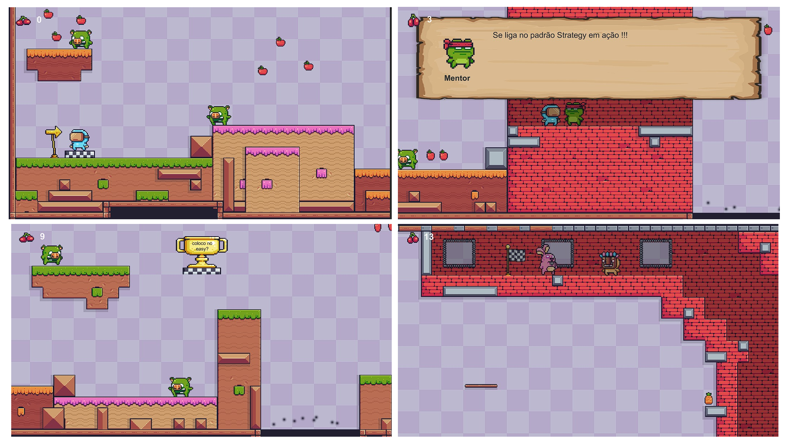

# 22-KO

Repositório dedicado ao projeto "22-KO"

Projeto proposto na disciplina de Programação Orientada a Objetos II, ministrada pelo Prof. Phyllipe Lima
da Universidade Federal de Itajubá - UNIFEI

<p align="center">
  
</p>

## Descrição
O objetivo do projeto é aplicar os seguintes padrões de projeto de software:
- [Strategy](https://en.wikipedia.org/wiki/Strategy_pattern) 
- [Observer](https://en.wikipedia.org/wiki/Observer_pattern)
- [Factory](https://en.wikipedia.org/wiki/Factory_(object-oriented_programming))

O projeto está sendo desenvolvindo na linguagem C#, utilizando a game engine [Unity](https://unity.com/).

## Funcionalidades
A aplicação conta com as seguites funcionalidades, de acordo com cada padrão de projeto:
- [x] [Strategy](https://en.wikipedia.org/wiki/Strategy_pattern): Alternancia de personagem jogável em tempo de execução.
- [x] [Observer](https://en.wikipedia.org/wiki/Observer_pattern): Implementa os Achievements do jogo.
- [x] [Factory](https://en.wikipedia.org/wiki/Factory_(object-oriented_programming)): Implementa a geração dos inimigos.

## Ferramentas e Assets utilizados
As seguintes ferramentas/assets foram utilizadas na construção do projeto:
- [Unity](https://unity.com/)
- [Asset: Pixel Adventure 1](https://assetstore.unity.com/packages/2d/characters/pixel-adventure-1-155360)
- [Asset: Pixel Adventure 2](https://assetstore.unity.com/packages/2d/characters/pixel-adventure-2-155418)

## Como utilizar?
### Requisito
- Unity (Versão 2021.3.10f1)

### Clone
Clone este repositório na sua máquina local.
```sh
git clone https://github.com/Binholf/22-KO.git
```

### Unity
- Abra o projeto no Unity.
- Selecione a scene "Fase1" no diretório Assets/Scenes
- Clique no ícone `Play` para rodar o jogo.

### Como jogar
- Movimentar: A e D 
- Pular: W
- Interagir: Space
- Respawn: Space
